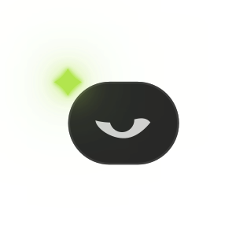
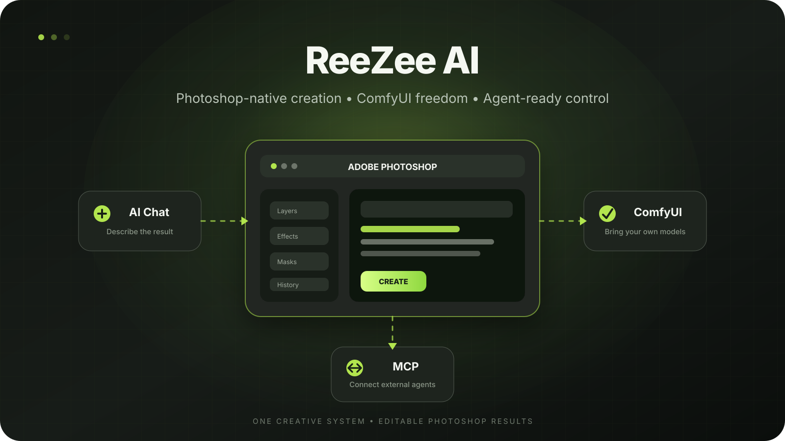
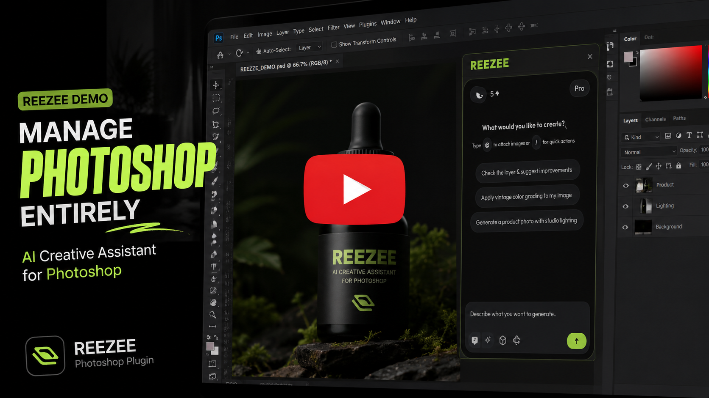

# ReeZee AI for Photoshop

## COMING SOON
 
**An AI-native Photoshop workspace with deep document control, your ComfyUI stack, and MCP-ready agents.**

[What it is](#what-is-reezee) · [Why it is different](#why-reezee-is-different) · [Coming soon](#coming-soon) · [Legacy plugin](#built-on-a-proven-idea)

## Quick feature demo

This is a quick demo of one of ReeZee's features in action:

> This is a quick demonstration of a single feature. ReeZee is being built with many more capabilities.

---

> [!IMPORTANT]
> # ReeZee is coming soon.
> There is **no public download yet**. The plugin is currently in private development and testing. This repository is a preview of what is being built — not an installable release.

---

## Business collaborations

Interested in partnering, enterprise licensing, or custom integration? Reach out for business collaboration opportunities:

---

## What is ReeZee?

ReeZee is a new Photoshop plugin that lets AI agents **understand and construct real Photoshop documents** instead of returning only a flattened image.

It combines four systems in one creative workflow:

| | |
|:--|:--|
| **Native Photoshop control** | Layers, editable text, masks, selections, transforms, adjustments, effects, and document structure |
| **ComfyUI integration** | Your checkpoints, LoRAs, ControlNets, custom nodes, and loaded workflows |
| **In-plugin AI agent** | Describe a result and let ReeZee inspect, plan, and operate on the active document |
| **MCP connectivity** | Connect supported external AI clients to Photoshop through ReeZee's local tool bridge |

> [!NOTE]
> ReeZee's ComfyUI workflow is independent of Adobe Firefly. Your models and workflows remain under your control.

---

## Why ReeZee is different

<table>
<tr>
<td width="33%" valign="top">

### Editable by design

ReeZee works with real Photoshop layers, text, masks, selections, and effects — not just pasted AI output.

</td>
<td width="33%" valign="top">

### Your AI stack

Keep using the ComfyUI models, workflows, LoRAs, ControlNets, and nodes you already trust.

</td>
<td width="33%" valign="top">

### Agent-ready

Work from ReeZee's built-in chat or connect an MCP-capable client to the same Photoshop tool surface.

</td>
</tr>
</table>

---

## A new kind of Photoshop workflow

1. **Describe** the composition or edit you want.
2. **ReeZee reads** relevant context from the active Photoshop document.
3. **The agent plans** bounded Photoshop or ComfyUI operations.
4. **Photoshop stays editable** with real document structure wherever supported.
5. **You remain in control** of the document, models, and final creative decisions.

<strong>What ReeZee is being built to control</strong>

 

- Documents, layers, groups, and transforms
- Editable typography with precise placement
- Masks, selections, and AI-assisted subject masking
- Layer effects, adjustments, fills, and reusable visual styles
- Smart Objects, content-aware operations, and image analysis
- ComfyUI image handoff and loaded-workflow execution
- History-aware agent operations and selected destructive-action approval
- External agent access through MCP

---

## Coming soon

> [!CAUTION]
> **Do not download or install files claiming to be the public ReeZee release.** An official public build has not been released yet. The download link and installation guide will appear in this repository when they are ready.

### Release progress

- [x] Photoshop-native operation layer
- [x] Deterministic layout and effects engine
- [x] ComfyUI bridge
- [x] In-plugin AI agent
- [x] MCP tool surface
- [ ] Fresh-install verification for the ReeZee `.ccx`
- [ ] Final Photoshop-host reliability testing
- [ ] Public installation guide
- [ ] **Official public release**

### Help ReeZee reach the finish line

ReeZee is built by a solo developer. The engineering is real and the progress is tangible — but getting from *working prototype* to a reliable public release takes more than code. It takes a community that believes in the idea and shows up for it.

**The best way to support ReeZee is collaboration, not just applause.** Try the workflow, report what breaks, suggest what matters to you, share it with someone who would actually use it. Every bit of real engagement moves this project closer to launch.

> [!NOTE]
> Stars are appreciated. But a tested build, a bug report, a feature request, or a conversation about how *you* would use ReeZee — that is what keeps it alive.

### Want early access or a technical evaluation?

---

## Built on a proven idea

ReeZee is the from-scratch successor to the original **[ComfyUI Photoshop Plugin](https://github.com/NimaNzrii/comfyui-photoshop)**.

The original plugin brought ComfyUI into Photoshop and grew to more than 1,000 GitHub stars. ReeZee keeps that core workflow and expands it with deeper Photoshop control, editable AI-built layouts, an in-plugin agent, document awareness, and MCP connectivity.

| Original plugin | ReeZee AI |
|:--|:--|
| Photoshop ↔ ComfyUI bridge | Photoshop ↔ ComfyUI bridge |
| Selection, crop, mask, and layer handoff | Deeper native document and layer control |
| Local and remote ComfyUI workflows | Built-in document-aware AI agent |
| Creator-owned models | Editable AI-constructed layouts and effects |
| Photoshop panel workflow | Photoshop panel plus MCP-capable clients |

> [!TIP]
> The original plugin remains available at [NimaNzrii/comfyui-photoshop](https://github.com/NimaNzrii/comfyui-photoshop). ReeZee is a separate new product, not a minor version update.

---

## Frequently asked questions

<strong>Can I download ReeZee now?</strong>

 

No. **ReeZee is coming soon** and currently has no official public build. Watch this repository for the verified download and installation guide.

<strong>Does ReeZee replace ComfyUI?</strong>

 

No. ReeZee connects Photoshop to ComfyUI. Your ComfyUI installation, workflows, models, and nodes remain yours.

<strong>Can it build a ComfyUI workflow from scratch?</strong>

 

Not yet. ReeZee can work with Photoshop context and queue the workflow already loaded in ComfyUI. Full graph authoring is not presented as a current capability.

<strong>Is the plugin source code in this repository?</strong>

 

No. This repository is the public presentation home for ReeZee. The implementation remains private during development and evaluation.

---

## ReeZee AI is coming soon.

**Photoshop is the canvas. ReeZee connects the intelligence around it.**

Created by <a href="https://github.com/NimaNzrii">Nima Nazari</a>

  

