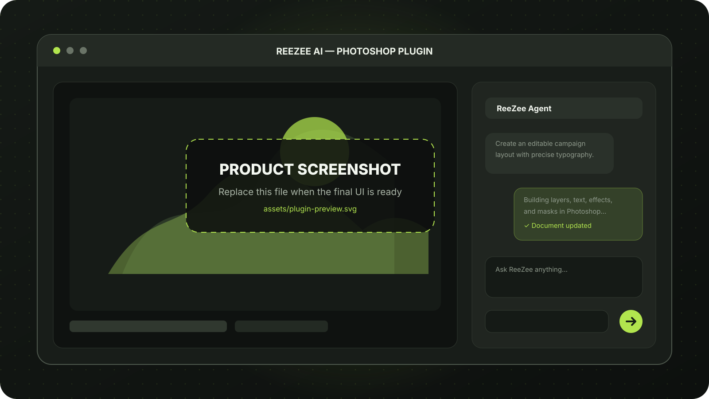
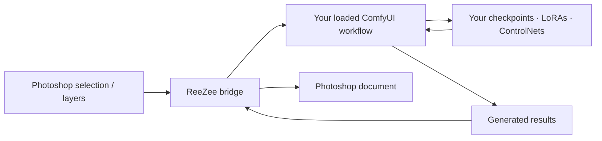

  

# ReeZee AI for Photoshop

### Native Photoshop control. Your ComfyUI stack. Any MCP-capable agent.

**ReeZee turns natural-language intent into real, editable Photoshop documents — while keeping your models, workflows, layers, masks, typography, and effects under your control.**

[Why ReeZee](#why-reezee) · [Capabilities](#what-reezee-controls) · [How it works](#how-it-works) · [Legacy](#from-blue-pixel-to-reezee) · [Availability](#availability)

<picture>
  <source media="(prefers-color-scheme: dark)" srcset="assets/brand-banner.svg">
  <source media="(prefers-color-scheme: light)" srcset="assets/brand-banner.svg">
  
</picture>

> [!IMPORTANT]
> **ReeZee is a from-scratch successor to the original [ComfyUI Photoshop Plugin](https://github.com/NimaNzrii/comfyui-photoshop).** It preserves the core Photoshop ↔ ComfyUI workflow and expands it into a deeper system for native document construction, agent-driven editing, deterministic layout, and external MCP control.

---

## Why ReeZee

Most AI image tools stop at a generated bitmap. ReeZee is built for the work that comes next.

<table>
<tr>
<td width="33%" valign="top">

### ◈ Build, don't paste

Create **real Photoshop structure**: editable layers, live text, masks, selections, adjustments, transforms, and effect stacks.

</td>
<td width="33%" valign="top">

### ◇ Keep your AI stack

Connect Photoshop to **ComfyUI** and continue using your own checkpoints, LoRAs, ControlNets, nodes, and existing workflows.

</td>
<td width="33%" valign="top">

### ⟡ Work with agents

Use ReeZee's in-plugin chat or connect an external MCP-capable client to inspect and operate on Photoshop through a shared tool surface.

</td>
</tr>
</table>

> [!NOTE]
> ReeZee is deliberately focused on the combination of **deep UXP-native Photoshop control + deterministic layout and effects + ComfyUI + MCP**. It is not a replacement for Photoshop, and it does not depend on Adobe Firefly for its ComfyUI workflow.

---

## See ReeZee in action

> [!TIP]
> **Screenshot placeholder:** replace `assets/plugin-preview.svg` with a final product screenshot or demo cover when the install-tested release is ready. Keep the same path to update this README automatically.

---

## What ReeZee controls

<strong>Photoshop-native creation</strong>

 

| Surface | What ReeZee can work with |
|:--|:--|
| **Documents & layers** | Create, inspect, rename, group, reorder, duplicate, transform, and manage layer structures |
| **Typography** | Create editable text with precise placement informed by real font bounds |
| **Effects & appearance** | Build effect stacks, adjustments, fills, opacity treatments, and reusable styling recipes |
| **Masks & selections** | Create and manipulate masks and selections, including AI-assisted subject masking |
| **Smart workflows** | Work with Smart Objects, content-aware fill, image statistics, and document layout analysis |
| **Safety & continuity** | Keep history-aware snapshots and surface approval before selected destructive actions |

<strong>Deterministic layout & effects engine</strong>

 

ReeZee includes a purpose-built rendering engine for constructing layered Photoshop compositions from structured design intent.

- **Editable output** instead of a flattened final image
- **Anchor-aware text placement** based on measured font bounds
- **Repeatable layout construction** for frames, text, groups, and visual effects
- **Ordered effect compilation** for complex, stacked appearances
- **Document-aware updates** after agent operations

This engine is the heart of ReeZee: AI proposes the composition, but Photoshop remains the final, editable source of truth.

<strong>Vision & document awareness</strong>

 

The agent can reason with more than a chat transcript. ReeZee provides document and image context through capabilities such as:

- Layer-tree and layout summaries
- Vision analysis
- Image statistics
- Layout digest generation
- AI subject masking with BiRefNet
- Authored design guidance for more informed visual decisions

<strong>Reusable knowledge</strong>

 

ReeZee is being built to retain useful creative knowledge without hiding what it is doing.

- Save repeatable multi-step agent recipes
- Reuse learned workflows with validation and history checkpoints
- Extract selected layer effects from PSD files into versioned local Style Packs
- Import and export Style Packs as portable JSON assets
- Keep bundled presets separate from user-authored style libraries

---

## Your models. Your workflows.

ReeZee keeps the original plugin's core promise: bring ComfyUI into the Photoshop workflow instead of forcing creators into a separate, closed generation stack.

### What carries forward from the original plugin

- Photoshop-to-ComfyUI image handoff
- Selection and layer context
- Mask-aware creative workflows
- Local or remote ComfyUI connection paths
- Results returning to the Photoshop-side experience
- Freedom to choose the models behind your workflow

> [!WARNING]
> ReeZee can queue the workflow currently loaded in ComfyUI. It does **not** yet author a complete ComfyUI graph from a chat prompt. We would rather state that boundary clearly than market a feature that is not ready.

---

## Use the agent where you work

<table>
<tr>
<td width="50%" valign="top">

### Inside Photoshop

Talk to ReeZee from the plugin panel. The agent can inspect document context, plan operations, request approval where needed, and execute through Photoshop's UXP APIs.

</td>
<td width="50%" valign="top">

### From an external AI client

Connect an MCP-capable client such as Claude Desktop or Cursor and expose the same Photoshop-oriented capabilities through ReeZee's local bridge.

</td>
</tr>
</table>

> [!NOTE]
> External MCP support is implemented, but the public preview remains gated while end-to-end reliability and installation are hardened.

---

## How it works

1. **Describe the outcome** in ReeZee's chat or through an MCP-capable client.
2. **ReeZee reads relevant context** from the active Photoshop document.
3. **The agent chooses bounded tools** for layout, layers, text, effects, masks, selections, or pipeline actions.
4. **Photoshop executes native operations** through UXP, DOM APIs, batch operations, and native image/layout helpers.
5. **ComfyUI joins when needed**, running the workflow you already control.
6. **The document stays editable** so the creator — not the model — has the final say.

---

## From Blue Pixel to ReeZee

The original **ComfyUI Photoshop Plugin** proved that creators wanted ComfyUI inside Photoshop. It grew to include real-time workflow sync, selection cropping and padding, mask previews, port configuration, remote ComfyUI connectivity, shortcuts, multilingual workflow support, and in-plugin updating.

ReeZee takes that foundation much further.

| | Original plugin | ReeZee AI |
|:--|:--:|:--:|
| Photoshop ↔ ComfyUI bridge | ✓ | ✓ |
| Selection, crop, mask, and layer handoff | ✓ | ✓ |
| Use your own ComfyUI models | ✓ | ✓ |
| In-Photoshop AI chat | — | ✓ |
| Native layer and document operations | Limited | **Deep UXP-native surface** |
| Editable AI-built layouts | — | ✓ |
| Precise typography and effect construction | — | ✓ |
| Document vision and layout awareness | — | ✓ |
| External MCP agent control | — | ✓ |
| Reusable agent recipes and Style Packs | — | **In preview** |

<strong>Explore the original project</strong>

 

The legacy repository remains available at **[NimaNzrii/comfyui-photoshop](https://github.com/NimaNzrii/comfyui-photoshop)**, with more than 1,000 GitHub stars and a community that helped shape the direction of ReeZee.

If the original plugin helped your workflow, thank you. ReeZee is being built as the next chapter — not a cosmetic version bump.

---

## Availability

> [!CAUTION]
> **ReeZee is not yet published as a public, install-ready release.** The current project is a private preview while packaging, fresh-install verification, host-level testing, security cleanup, and reliability work are completed.

### Current preview status

- [x] Deep Photoshop operation layer implemented
- [x] Deterministic layout and effects engine implemented
- [x] ComfyUI bridge implemented
- [x] In-plugin agent experience implemented
- [x] MCP tool surface implemented
- [x] Focused tests for agent memory and Style Pack subsystems
- [ ] Clean ReeZee `.ccx` verified on a fresh Photoshop installation
- [ ] Full Photoshop-host demo matrix completed
- [ ] Public download and installation guide published

**Want to evaluate ReeZee, discuss licensing, or follow the release?**

---

## Frequently asked questions

<strong>Does ReeZee replace ComfyUI?</strong>

 
No. ReeZee connects Photoshop to ComfyUI and coordinates the creative workflow. Your ComfyUI installation, workflows, models, and nodes remain yours.

<strong>Does ReeZee flatten every result?</strong>

 
No. A central goal is to construct editable Photoshop documents with real layers, text, masks, adjustments, and effects wherever the operation supports it. Generated imagery can still enter the document as pixels, but the surrounding composition does not need to become one flattened image.

<strong>Does it use Adobe Firefly?</strong>

 
ReeZee's ComfyUI bridge is independent of Adobe's generative stack. Optional providers may be available for other generation paths, but your local ComfyUI workflow does not require Firefly.

<strong>Can ReeZee build a ComfyUI workflow from scratch?</strong>

 
Not yet. The current integration can send Photoshop context to ComfyUI and queue the workflow already loaded there. Full graph authoring is not advertised as a working capability.

<strong>Is this repository the plugin source code?</strong>

 
No. This repository is the public presentation home for ReeZee. The implementation remains private during the preview and evaluation phase.

<strong>Can I use ReeZee commercially?</strong>

 
Commercial terms and preview access are handled directly. Contact **[nimanzriart@gmail.com](mailto:nimanzriart@gmail.com)** to discuss licensing or evaluation.

---

## Project principles

- **Native before simulated** — use modern Photoshop UXP capabilities rather than fragile legacy scripting.
- **Editable before flattened** — preserve document structure whenever possible.
- **Local freedom before lock-in** — keep ComfyUI models and workflows in the creator's hands.
- **Honest boundaries before hype** — distinguish implemented, verified, preview, and planned capabilities.
- **Creator control before autonomy theater** — the agent helps build; the human owns the final document.

### Photoshop is the canvas. ReeZee connects the intelligence around it.

Created by <a href="https://github.com/NimaNzrii">Nima Nazari</a> · Successor to the original <a href="https://github.com/NimaNzrii/comfyui-photoshop">ComfyUI Photoshop Plugin</a>

  

